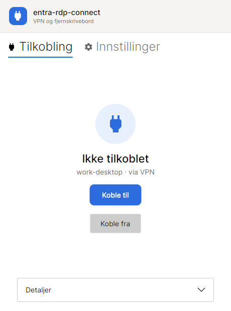
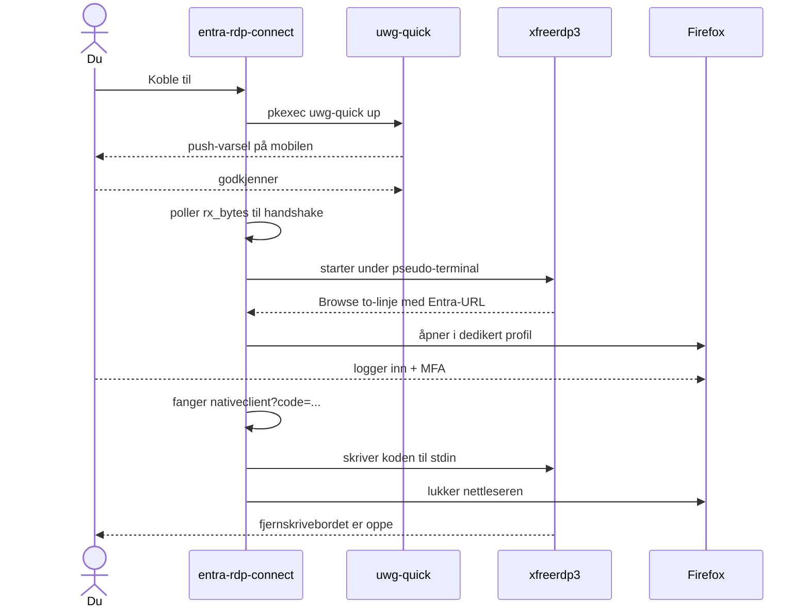
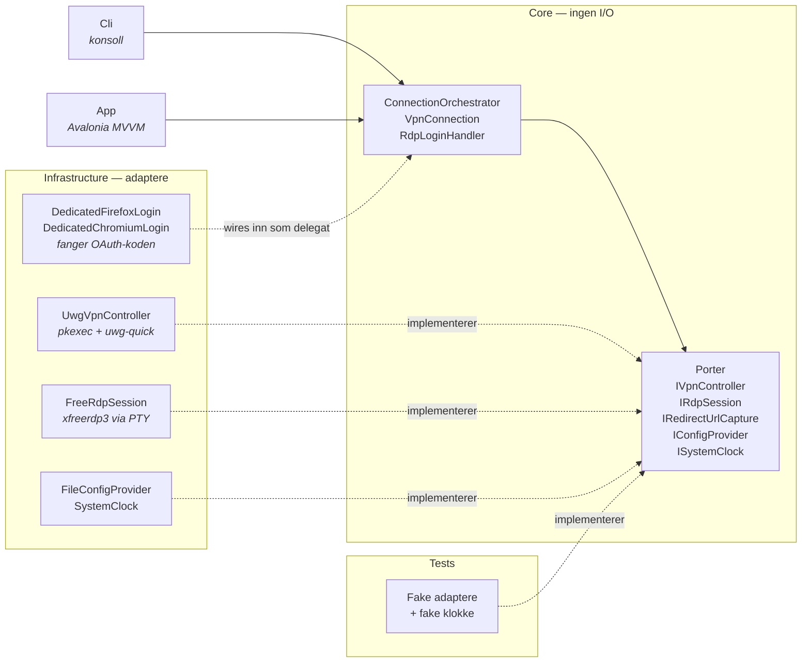

<div align="center">

# entra-rdp-connect

**Én-klikks tilkobling fra Linux til en Entra ID-tilknyttet Windows-PC, med eller uten VPN.**

[](https://dotnet.microsoft.com/)
[](https://avaloniaui.net/)
[](#fungerer-dette-for-meg)
[](#arkitektur)
[](https://github.com/Rune-Pune/entra-rdp-connect/actions/workflows/ci.yml)
[](LICENSE)



</div>

---

## Hvorfor finnes denne?

Å nå en Entra ID-tilknyttet Windows-PC fra Linux er tungvint på en helt bestemt måte. De grafiske
klientene — Remmina, GNOME Connections, KRDC — bygger alle på FreeRDP, men kommer ikke gjennom
Entra-innloggingen, og Microsofts egen klient finnes ikke for Linux. FreeRDP fra kommandolinjen
*virker*, men da må du logge inn i nettleseren, grave fram en retur-adresse fra historikken og
lime den inn i terminalen — **før koden utløper, på under ett minutt**. Hver gang.

Det er hullet denne appen fyller. Den reiser VPN-tunnelen, venter på push-godkjenningen, starter
fjernskrivebordet og **fanger koden automatisk**. Igjen står bare de to øyeblikkene som faktisk
krever et menneske: godkjenne på mobilen, og logge inn i nettleseren.

> Appen er en **orkestrator**: den snakker verken WireGuard- eller RDP-protokollen selv, men
> driver eksisterende systemverktøy — slik GitHub Desktop wrapper `git`.

---

## Slik ser flyten ut



De to stedene som krever et menneske — push på mobilen og innlogging i nettleseren — markeres
tydelig i GUI-et. Resten går av seg selv.

---

## Fungerer dette for meg?

Du trenger dette oppsettet (appen er ikke en generell RDP-klient):

| Krav | Hvorfor |
|------|---------|
| **Linux med X11** (utviklet på Ubuntu 24.04) | `pkexec`, prosess-orkestrering |
| **VPN til nettverket maskinen står i** — *valgfritt* | Appen kan reise en UniFi Identity «Adaptive VPN»-tunnel selv (`uwg-quick`). Har du en annen VPN, eller når maskinen direkte, lar du feltet stå tomt og appen går rett på RDP |
| **UniFi Identity-appen på mobil** | Bare hvis appen styrer VPN — tunnelen kommer ikke opp før du godkjenner push-varselet |
| **Entra ID-tilknyttet (Azure AD-joined) mål-PC**, nåbar over VPN-en | `xfreerdp3 /sec:aad` virker bare mot Entra-joined maskiner |
| **FreeRDP 3** (`xfreerdp3`), `script`, `pkexec` og en nettleser | Systemverktøyene appen driver. Mangler noe, sier appen fra ved oppstart og tilbyr å installere det som finnes i pakkebrønnen. Firefox og Chromium-baserte lesere gir [automatisk kodefangst](#nettlesere); andre fungerer med manuell innliming |
| **.NET 10 SDK** (kun for å bygge) | Publisert binær er self-contained |

**VPN er valgfritt.** Lar du `vpn.interface` stå tom, hopper appen over hele VPN-steget og går rett
på fjernskrivebordet — nyttig hvis maskinen er nåbar direkte, eller du bruker en VPN som settes opp
utenfor appen. Vil du at appen skal styre en *annen* VPN-klient, bytter du ut adapteren
(se [Arkitektur](#arkitektur)) uten å røre resten.

---

## Kom i gang

### Alternativ A — last ned ferdig binær

Hver utgivelse under [**Releases**](https://github.com/Rune-Pune/entra-rdp-connect/releases)
inneholder én selvstendig fil for Linux x64, bygget av GitHub Actions fra kildekoden ved den
taggen. Sjekksummen under verifiserer at nedlastingen er intakt — den beviser ikke opphavet.
Vil du være helt sikker, bygger du selv (alternativ B).

```bash
# bytt vX.Y.Z med siste versjon
curl -LO https://github.com/Rune-Pune/entra-rdp-connect/releases/download/vX.Y.Z/entra-rdp-connect
curl -LO https://github.com/Rune-Pune/entra-rdp-connect/releases/download/vX.Y.Z/entra-rdp-connect.sha256
sha256sum -c entra-rdp-connect.sha256      # verifiser nedlastingen
chmod +x entra-rdp-connect && ./entra-rdp-connect
```

.NET trengs ikke — runtimen ligger i fila. Systemavhengighetene under må fortsatt være på plass.

Vil du ha den i app-menyen, legg den der `.desktop`-fila peker og installer oppføringen:

```bash
mkdir -p ~/.local/opt/entra-rdp-connect
mv entra-rdp-connect ~/.local/opt/entra-rdp-connect/
curl -LO https://raw.githubusercontent.com/Rune-Pune/entra-rdp-connect/main/packaging/entra-rdp-connect.desktop
sed "s|__HOME__|$HOME|" entra-rdp-connect.desktop > ~/.local/share/applications/entra-rdp-connect.desktop
update-desktop-database ~/.local/share/applications
```

### Alternativ B — bygg selv

```bash
git clone https://github.com/Rune-Pune/entra-rdp-connect.git
cd entra-rdp-connect
dotnet build && dotnet test
```

### 1. Konfigurer

Kopier malen og fyll inn dine verdier — filen er **ikke** i git:

```bash
mkdir -p ~/.config/entra-rdp-connect
cp config.sample.json ~/.config/entra-rdp-connect/config.json
```

| Felt | Betydning |
|------|-----------|
| `vpn.interface` | Navnet på WireGuard-konfigurasjonen (`/etc/wireguard/<navn>.conf`). **La stå tom** hvis du ikke vil at appen skal styre VPN |
| `vpn.handshakeTimeoutSeconds` | Hvor lenge vi venter på push-godkjenningen (brukes bare med VPN) |
| `rdp.host` | **Maskinnavn, ikke IP** (se fallgruver) |
| `rdp.hostIp` | Adressen navnet peker på. Brukes bare hvis navnet ikke slås opp |
| `rdp.user` | Din Entra-UPN, f.eks. `you@example.com` |
| `rdp.extraArgs` | Argumenter til `xfreerdp3`. `/sec:aad` er påkrevd mot Entra-joined maskiner |

Alle feltene kan redigeres i **Innstillinger**-fanen i GUI-et — dette er alt appen trenger.
Ingen passord lagres noe sted; innlogging skjer i nettleseren og med push på mobilen.

### 2. Verten må slå opp på navn

Tilkoblingen skjer på **navn, ikke IP** — FreeRDP kapper en IP ved første punktum og feiler mot
Entra. Appen sjekker dette ved oppstart: hvis navnet ikke lar seg slå opp, sier **Innstillinger**
fra og tilbyr å legge inn oppføringen i `/etc/hosts` for deg (via `pkexec`).

Vil du gjøre det selv, er linja:

```
10.0.0.10   work-desktop
```

### 3. Kjør

```bash
dotnet run --project src/EntraRdpConnect.App            # GUI
dotnet run --project src/EntraRdpConnect.Cli -- connect # CLI, hele kjeden
```

Andre CLI-kommandoer: `vpn-up`, `vpn-down`, `vpn-status`, `rdp`, og uten argument en
status-oversikt som viser hvilke systemavhengigheter som mangler.

Går noe galt i innloggingen, viser `ERC_RDP_DEBUG=1` rå output fra `xfreerdp3` (autorisasjons-
koden maskeres). Virker i både CLI og GUI.

### 4. Installer som skrivebordsapp (valgfritt)

```bash
dotnet publish src/EntraRdpConnect.App -c Release -r linux-x64 --self-contained true \
  -p:PublishSingleFile=true -p:IncludeNativeLibrariesForSelfExtract=true -p:DebugType=none \
  -o ~/.local/opt/entra-rdp-connect
mkdir -p ~/.local/share/icons ~/.local/share/applications
cp src/EntraRdpConnect.App/Assets/entra-rdp-connect.png ~/.local/share/icons/
sed "s|__HOME__|$HOME|" packaging/entra-rdp-connect.desktop \
  > ~/.local/share/applications/entra-rdp-connect.desktop
update-desktop-database ~/.local/share/applications
```

Deretter startes appen fra app-menyen. Ingen .NET-runtime kreves for å kjøre den.

---

## Nettlesere

Appen velger selv, i denne rekkefølgen:

| Nettleser | Kodefangst | Merknad |
|-----------|-----------|---------|
| **Firefox** | automatisk | Foretrukket — skriver historikken til disk nesten umiddelbart |
| **Chrome, Chromium, Edge, Brave, Vivaldi** | automatisk | Fungerer, men Chromium venter **~10–15 sekunder** før historikken flushes. Koden lever under ett minutt, så marginen er trangere |
| **Alle andre** | manuell | Innloggingen åpnes i standard nettleser, og du limer inn adressen i appen |

Manuell innliming brukes også som redning hvis automatisk fangst feiler eller tar for lang tid, så
du aldri står fast.

### Hvorfor leser appen nettleserhistorikken?

FreeRDP gjør Entra-innloggingen ved å skrive ut en lenke og så vente på at du limer inn en
retur-adresse. Den adressen finnes bare som et flyktig navigasjonssteg i nettleseren, og
**autorisasjonskoden utløper på under ett minutt**. Manuelt betyr det: logg inn, grav fram
adressen fra historikken, kopier, lim inn — raskt.

Appen automatiserer dette ved å åpne innloggingen i en **egen nettleserprofil** og lese
historikkdatabasen til `nativeclient?code=`-adressen dukker opp. Da lukkes
nettleseren, og koden sendes videre. Den dedikerte profilen gjør to ting: den holder historikken
ren, så vi aldri plukker en utløpt kode fra en tidligere økt, og den lar appen lukke *sitt eget*
nettleservindu uten å røre fanene dine.

> Vi prøvde først en innebygd nettleser (WebView) for å slippe et eksternt vindu. Den lastet
> sidene korrekt, men den native flaten rendret blankt på Avalonia + X11, så løsningen ble
> forkastet. Historikken ligger i repoet om noen vil ta opp tråden.

### Bruker du en nettleser uten støtte?

1. Innloggingen åpnes i **din standard nettleser** (via `xdg-open`).
2. Du logger inn som vanlig.
3. Nettleseren lander kort på en adresse med `code=` i seg før den hopper videre til en
   `wrongplace`-side. Hent adressen fra historikken (`Ctrl+H`) eller med `Alt+←`.
4. Lim den inn i feltet i appen og trykk **Bruk denne**. Vær rask — koden utløper.

### Teknisk: hva skiller nettleserne

Firefox lagrer historikken i `places.sqlite` (tabell `moz_places`, tidsstempler i mikrosekunder
siden 1970). Chromium-baserte lesere bruker `<profil>/Default/History` (tabell `urls`, mikrosekunder
siden **1601**). Begge er implementert som hver sin `IRedirectUrlCapture`-adapter — se
[Arkitektur](#arkitektur). Vil du støtte en ny nettleser, skriver du én adapter til og bytter den
inn i composition root.

---

## Arkitektur

**Ports & Adapters (hexagonal).** Avhengighetene peker innover — kjernen vet ingenting om
prosesser, nettverk eller GUI:



> **Merk:** innloggingsadapterne (`DedicatedFirefoxLogin`/`DedicatedChromiumLogin`) implementerer
> ikke en port ennå — de sendes inn som en delegat fra composition root. Å splitte dem i
> `IBrowserLauncher` + `IRedirectUrlCapture`, slik `EntraLoginResolver` allerede forutsetter, står
> på lista over forbedringer.

| Prosjekt | Innhold |
|----------|---------|
| `EntraRdpConnect.Core` | Domene, applikasjonslogikk og **porter**. Ingen I/O, ingen eksterne avhengigheter. |
| `EntraRdpConnect.Infrastructure` | **Adaptere**: prosesskjøring, VPN (`uwg-quick`), RDP (`xfreerdp3`), nettleser-innlogging, config. |
| `EntraRdpConnect.Cli` | Konsoll-driver + composition root. |
| `EntraRdpConnect.App` | Avalonia MVVM-GUI + composition root. |
| `EntraRdpConnect.Tests` | xUnit — orkestrering og parsing mot fake adaptere. |

**Hvorfor bry seg?** Den ekte flyten kan **ikke** integrasjonstestes — den krever en mobil-push, en
Entra-tenant og en påslått målmaskin. Ved å legge alt det bak porter kan hele tilkoblingskjeden
kjøres i enhetstester med fake adaptere og en fake klokke: «push uteblir → tydelig timeout» testes
på millisekunder i stedet for 45 ekte sekunder.

Vil du støtte en annen VPN- eller nettleserstack, implementerer du ett grensesnitt og bytter det
inn i composition root — resten av koden er uendret.

---

## Fallgruver dette prosjektet løser

Alle funnet gjennom feilsøking mot ekte oppsett:

- **Koble til på navn, ikke IP.** FreeRDP kapper en IP ved første punktum og sender `10` som
  enhetsnavn til Entra → `AADSTS293004`.
- **`/sec:aad` er eneste vei inn** på Entra-joined maskiner; CredSSP med Entra-passord feiler alltid.
- **FreeRDPs AAD-innlogging krever en terminal.** Den leser koden via `tcgetattr` på stdin, så
  vanlige rør gir vranglås — appen kjører `xfreerdp3` under en pseudo-terminal (`script`).
- **`/cert:tofu` blokkerer** fordi Entras P2P-sertifikat roterer hver ~5. time; `/cert:ignore` er
  riktig her (trafikken er allerede beskyttet av VPN-tunnelen og Entra/NLA).
- **Uten `MfaToken = up:1`** i WireGuard-konfigurasjonen feiler oppkoblingen i total stillhet.
- **VPN-status uten root:** `/sys/class/net/<if>/statistics/rx_bytes` — så polling ikke ber om
  passord hvert sekund.
- **OAuth-koden utløper på under et minutt** — derav automatisk fangst i stedet for kopier/lim.
- **Sync-over-async ved GUI-oppstart** ga vranglås på UI-tråden; ViewModel-treet bygges nå på en
  bakgrunnstråd.

---

## Teknologi

.NET 10 · C# (records, nullable, async) · Avalonia 12 + CommunityToolkit.Mvvm ·
Microsoft.Extensions.DependencyInjection · xUnit

## Lisens

MIT — se [LICENSE](LICENSE).
