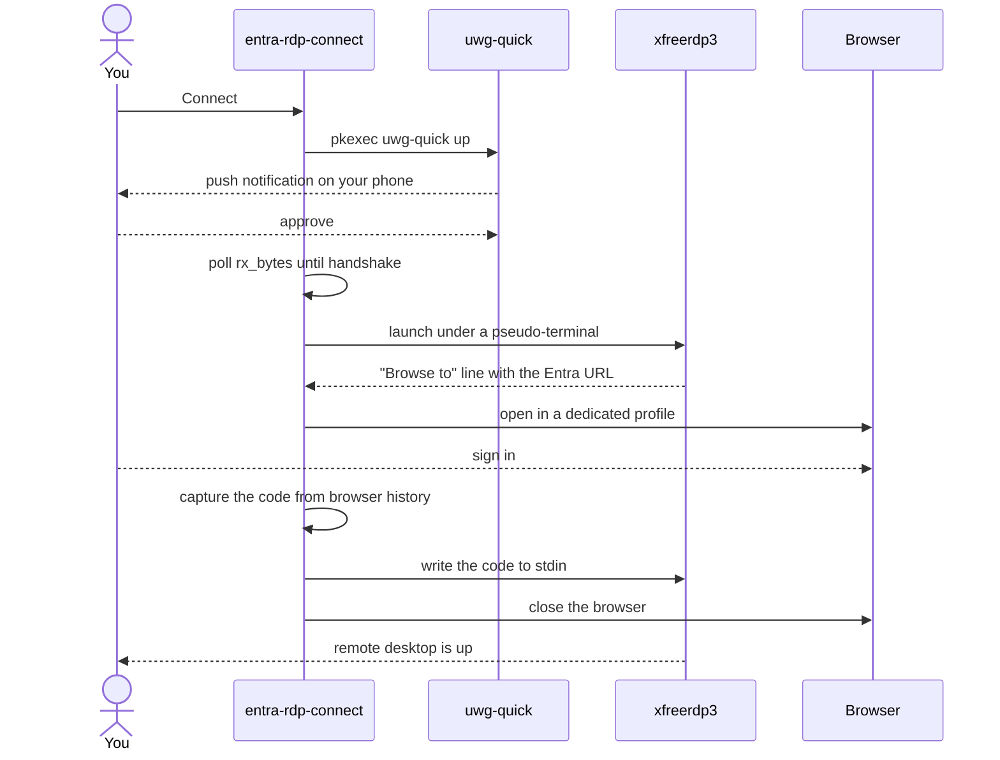
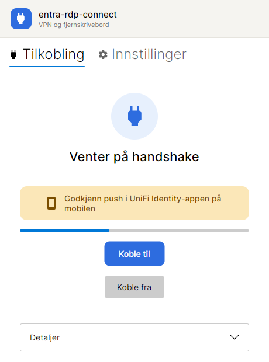
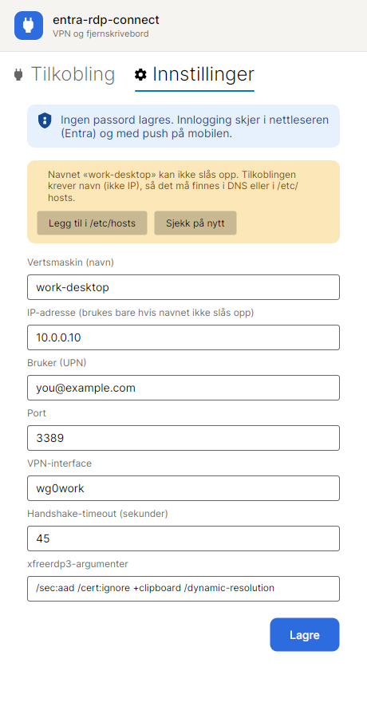
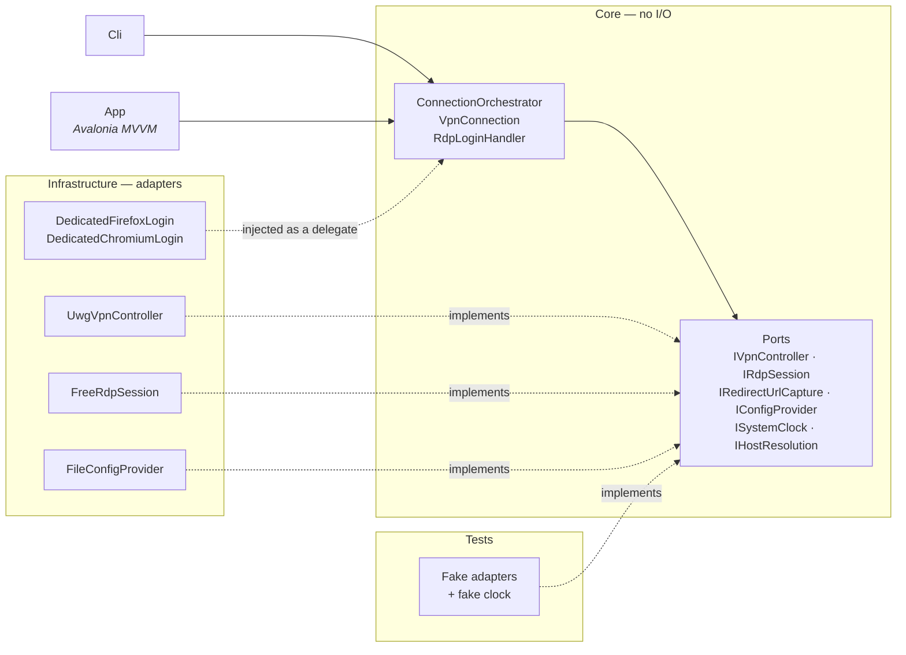

<div align="center">

# entra-rdp-connect

**One-click remote desktop from Linux to an Entra ID-joined Windows PC — with optional VPN.**

[](https://dotnet.microsoft.com/)
[](https://avaloniaui.net/)
[](#requirements)
[](#architecture)
[](https://github.com/Rune-Pune/entra-rdp-connect/actions/workflows/ci.yml)
[](LICENSE)


</div>

---

## Why this exists

Reaching an **Entra ID-joined Windows PC** from Linux is awkward in one specific way.

The graphical clients — Remmina, GNOME Connections, KRDC — all wrap FreeRDP, but none of them get through the Entra sign-in. Microsoft's own client doesn't exist for Linux. FreeRDP from the command line *does* work, but then you have to sign in through a browser, dig a redirect URL out of your history, and paste it back into the terminal — **before the code expires, in under a minute.** Every single time.

This app does that last step for you.

## How it works



Exactly **two moments need a human**: approving the push on your phone, and signing in. The app makes both obvious and waits for you — everything else is automatic.

<div align="center">

</div>

> No VPN configured? The first three steps are skipped and the app goes straight to the remote desktop.

## Requirements

| Requirement | Notes |
|---|---|
| **Linux desktop** | Developed and tested on Ubuntu 24.04 |
| **An Entra ID-joined target PC** you can reach | `xfreerdp3 /sec:aad` only works against Entra-joined machines |
| **FreeRDP 3** (`xfreerdp3`), `pkexec`, `script`, a browser | The system tools the app drives. It checks at startup and offers to install what's missing |
| **VPN** — *optional* | The app can raise a UniFi Identity "Adaptive VPN" tunnel via `uwg-quick`. Using another VPN, or none? Leave the field blank |
| **.NET 10 SDK** | Only if you build it yourself |

## Install

Each release is a single self-contained file — no .NET runtime needed.

```bash
# replace vX.Y.Z with the latest release
curl -LO https://github.com/Rune-Pune/entra-rdp-connect/releases/download/vX.Y.Z/entra-rdp-connect
curl -LO https://github.com/Rune-Pune/entra-rdp-connect/releases/download/vX.Y.Z/entra-rdp-connect.sha256
sha256sum -c entra-rdp-connect.sha256
chmod +x entra-rdp-connect && ./entra-rdp-connect
```

The checksum confirms the download is intact — it does not prove where the binary came from. Build it yourself if you want certainty.

<details>
<summary><b>Build from source, and add it to your app menu</b></summary>

```bash
git clone https://github.com/Rune-Pune/entra-rdp-connect.git
cd entra-rdp-connect
dotnet build && dotnet test

dotnet publish src/EntraRdpConnect.App -c Release -r linux-x64 --self-contained true \
  -p:PublishSingleFile=true -p:IncludeNativeLibrariesForSelfExtract=true -p:DebugType=none \
  -o ~/.local/opt/entra-rdp-connect

mkdir -p ~/.local/share/icons ~/.local/share/applications
cp src/EntraRdpConnect.App/Assets/entra-rdp-connect.png ~/.local/share/icons/
sed "s|__HOME__|$HOME|" packaging/entra-rdp-connect.desktop \
  > ~/.local/share/applications/entra-rdp-connect.desktop
update-desktop-database ~/.local/share/applications
```

There is also a CLI for scripting and troubleshooting: `connect`, `vpn-up`, `vpn-down`, `vpn-status`,
`rdp`, and — with no arguments — a status overview of your system dependencies.
Set `ERC_RDP_DEBUG=1` to echo raw `xfreerdp3` output (the authorization code is masked).

</details>

## Configure

Everything the app needs lives in the **Settings** tab. No passwords are stored anywhere — you sign in through the browser and approve on your phone.

<div align="center">

</div>

| Field | Meaning |
|---|---|
| **Host** | The machine **name** — never an IP (see [pitfalls](#pitfalls-this-project-solves)) |
| **IP address** | Only used if the name doesn't resolve; the app offers to add it to `/etc/hosts` for you |
| **User** | Your Entra UPN, e.g. `you@example.com` |
| **VPN interface** | The WireGuard config name (`/etc/wireguard/<name>.conf`). **Leave blank** to skip VPN entirely |
| **xfreerdp3 arguments** | `/sec:aad` is required against Entra-joined machines |

Settings are stored as JSON at `~/.config/entra-rdp-connect/config.json`.

The interface follows your system language, with **English** and **Norwegian** available today.
Override it in the **Language** dropdown, or add a language by dropping a `Strings.<code>.resx`
next to the existing ones — a test fails if any key is left untranslated.

## Browsers

The app picks one automatically, in this order:

| Browser | Code capture | Notes |
|---|---|---|
| **Firefox** | automatic | Preferred — writes history to disk almost immediately |
| **Chrome, Chromium, Edge, Brave, Vivaldi** | automatic | Works, but Chromium waits **10–15 seconds** before flushing history. The code lives under a minute, so the margin is tighter |
| **Anything else** | manual | Sign-in opens in your default browser; you paste the address into the app |

Manual entry is also the fallback when automatic capture fails, so you are never stuck.

Sign-in uses a **dedicated browser profile** kept at `0700`. It holds a live session on purpose — that's what lets you skip MFA next time — and the browser is closed automatically once the code is captured.

## Architecture

**Ports & Adapters.** Dependencies point inward; the core knows nothing about processes, networking or UI.



> The login adapters don't implement a port yet — they're injected as a delegate. Splitting them into `IBrowserLauncher` + `IRedirectUrlCapture` is on the backlog.

**Why bother?** The real flow *cannot* be integration-tested: it needs a push notification on a phone, an Entra tenant, and a powered-on target machine. Putting all of that behind ports means the whole connection chain runs in unit tests against fakes — so "the push never arrives → clear timeout" is verified in milliseconds instead of 45 real seconds.

Want a different VPN or browser? Implement one interface and swap it in the composition root. Nothing else changes.

## Pitfalls this project solves

All found by debugging against a real setup:

- **Connect by name, not IP.** FreeRDP truncates an IP at the first dot and sends `10` as the device name to Entra → `AADSTS293004`.
- **FreeRDP's Entra sign-in needs a terminal.** It reads the code via `tcgetattr` on stdin, so ordinary pipes deadlock. The app runs `xfreerdp3` under a pseudo-terminal.
- **`/cert:tofu` blocks** because the Entra P2P certificate rotates roughly every 5 hours. `/cert:ignore` is the right call here — the connection is already protected by the tunnel and Entra/NLA.
- **Without `MfaToken = up:1`** in the WireGuard config, the tunnel fails in complete silence.
- **VPN status without root:** read `/sys/class/net/<if>/statistics/rx_bytes`, so polling never asks for a password.
- **The OAuth code expires in under a minute** — hence automatic capture instead of copy-paste.

## Tech

.NET 10 · C# (records, nullable, async) · Avalonia 12 + CommunityToolkit.Mvvm · xUnit · 87 tests

## Contributing

Issues and pull requests are welcome — see [CONTRIBUTING.md](CONTRIBUTING.md) for how to build,
test and submit. `main` requires a green CI run and a pull request, for the maintainer too.

Security issues go through [SECURITY.md](SECURITY.md) rather than a public issue.

## License

MIT — see [LICENSE](LICENSE).
